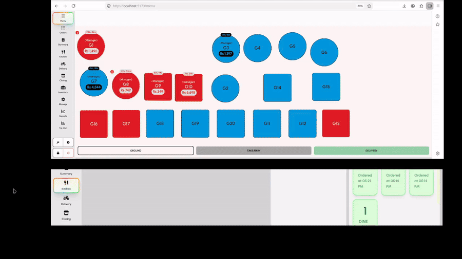

# POSR — AI Powered Open Source Modern Restaurant Operations Platform (POS)

> Offline-first restaurant operations — ordering, KDS, inventory, labor, accounting, AI reporting, and delivery in one platform.

React · Vite · Bun · SurrealDB · WebSockets · IndexedDB

## Links

- [**Documentation:** ](https://ahmedali5530.xyz/posr/docs)
- [**Get started — Installation & first sale:**](https://ahmedali5530.xyz/posr/docs)
- [**Live demo:**](https://ahmedali5530.xyz/posr) — pins `1234`, `0000`, `5555` (super admin)
- [**Landing / product:**](https://ahmedali5530.xyz/posr)
- **Integrations framework (dev):** [docs/integrations/framework.md](docs/integrations/framework.md)
- **Auth gateway:** [docs/security/GATEWAY.md](docs/security/GATEWAY.md)

---

## Feature inventory

### AI & reporting

- **Natural language analytics** — ask plain-text questions; get visual reports across sales, inventory, accounts, and labor
- **Descriptive analytics** — patterns, anomalies, voids/discounts, performance drivers
- **Sales forecasting** — demand prediction for staffing, purchasing, promotions
- **AI inventory forecasting** — purchase quantity suggestions from history, stock, holidays, weather, events
- **AI staff forecasting** — recommended hours/headcount vs schedule and same-weekday history
- **Order dossier** — full order timeline by ID, number, or invoice (dishes, voids, payments, kitchen, fiscal, prints)
- **Sales vs consumption** — recipe usage vs ledger issuance vs purchases
- **AI Import** — OCR/parse CSV, Excel, PDF, images, clipboard for master data, document lines, journals, HR shifts (create / update / upsert)
- **AI usage controls** — daily/monthly quotas; disable AI entirely

### Restaurant operations

- **Table-based ordering** — seat assignments, split by seat, multi-order tables
- **Takeaway mode** — pickup queue, customer name/phone/time
- **Order lifecycle** — split / merge / cancel / transfer / refunds
- **Modifiers** — groups, nested modifiers, price overrides, min/max rules
- **Visual menu builder** — dishes, categories, multi-category, tax rules
- **Multiple menus** — breakfast/lunch/dinner, dynamic pricing, delivery menu link
- **Extras & service charges** — fixed/%, rule-based by order type / payment / table
- **Discounts & coupons** — fixed/%, Buy X Get Y, payment-type promos, delivery coupons
- **KDS** — multi-stage workflows, station routing, status (received → served), recall, grouped addons, voice alerts
- **Closing cycles** — auto check close, shift/day close, enforcement + notifications
- **Tips** — pooling, staff rules, shift allocation
- **Waiter app** — mobile order entry, table select, touch-optimized
- **Manager app** — dashboard, analytics, config, branch reporting
- **Delivery app** — dispatch, driver tracking, Maps, realtime customer updates, coupons

### Inventory

- **Location-based stock** — stores/kitchens as inventory locations
- **Stock transfers** — location-to-location with ledger posting
- **Kitchen reconciliation** — theoretical (recipe × sales) vs actual by location
- **Kitchen production** — batch prep, yields, ingredient consumption
- **Buffet production** — portion planning, session close, replenishment
- **Recipe deduction** — stock-aware menus; auto deduct on sale
- **Documents** — purchase orders, purchases/returns, issues/returns, adjustments, waste
- **Inventory dashboard** — transfers, production, buffet, runout forecast, low-stock alerts
- **Suppliers** — supplier master + performance

### Labor & HR

- **Shift scheduling** — create/assign schedules; **print schedule roster** (week grid, PDF/Excel)
- **Clock-in / clock-out** — work hours, late/early detection
- **Attendance** — history logs; bulk AI Import (pending until manager approve)
- **Leave & holidays** — paid/unpaid leave in payroll
- **Pay profiles** — hourly, daily wage, or flat period (monthly/weekly/contract)
- **Payroll runs** — preview, overrides, approve/post
- **Org structure** — employees, departments, positions, cost centers, branch assignment
- **RBAC** — admin, manager, waiter, kitchen, delivery, custom roles; protected modules (web + mobile)

### Accounting & payments

- **Internal ledger** — chart of accounts, journals, GL / TB / BS / P&L style reporting
- **Closing & reconciliation** — checks, shifts, days; audit-ready payment trail
- **Payment gateways** — Stripe, PayPal, JazzCash, M-Pesa, Telebirr, Razorpay (sandbox/live, webhooks)
- **QuickBooks Online** — OAuth; sync sales, payments, customers, refunds; journals for inventory/payroll/waste; import COA / vendors / tax codes
- **Fiscal (Pakistan)** — **FBR** and **PRA** invoice submission at settlement (API-proxied); receipt logos / QR

### Integration Manager

- **Plugin hub** — enable/configure providers without coupling POS screens ([framework docs](docs/integrations/framework.md))
- **Event-driven** — fan-out sales, inventory, HR, accounts, ops, lifecycle, and `EntityChanged` master-data events
- **Offline queue** — retries, dedupe, IndexedDB persistence; settlement not blocked by slow APIs
- **Health & audit** — provider health, job queue UI, audit log
- **Integrations UI** — providers, configuration, queue, health panels
- **Permissions** — toggle provider, open/save configuration (manager PIN when missing)
- **Providers (shipped):**
  - **FBR Fiscalization** — FBR invoices at settlement
  - **PRA Fiscalization** — PRA invoices at settlement
  - **Internal Accounting** — draft journals from sales, refunds, payroll, purchases, waste, issues, transfers, production
  - **Internal Inventory** — inventory integration hooks
  - **QuickBooks Online** — external accounting sync (see above)
  - **Event Logger** — all/filtered events → console or HTTP (bearer / API key / basic / JWT)

### Platform

- **Offline-first** — IndexedDB + realtime WebSocket sync; automatic cloud backups
- **Auth gateway** — session JWT; Surreal credentials not shipped to browser ([GATEWAY.md](docs/security/GATEWAY.md))
- **ESC/POS printing** — USB, Serial, Network, Bluetooth; kitchen tickets, receipts, delivery slips, pre-sale bills, sales summaries; custom logos
- **Multi-lingual** — English, Español, Türkçe, Português, Français, Nederlands, Deutsch, Italiano, العربية (RTL), Русский (Cyrillic); live language switch
- **Tech stack** — React + TypeScript, Bun + Vite, SurrealDB, WebSockets

---

## See it in action



- [Watch full video](https://ahmedali5530.xyz/assets/posr/demo.mp4)
- [Order taking app flow](https://www.youtube.com/watch?v=VP3zBUfHtYQ&list=PLAnQKFs1ybdM&pp=sAgC)

## Screenshots


---

## Quick Start

Full install and first-sale walkthrough: **[Documentation → Get started](https://ahmedali5530.xyz/posr/docs)**

```bash
git clone https://github.com/ahmedali5530/restaurant-pos
cd restaurant-pos
cp .env.example .env
cp api/.env.example api/.env
cp gateway/.env.example gateway/.env
cp payments/.env.example payments/.env
bun install
docker compose up -d
```

Copied `.env` files include **local-dev** Surreal and JWT values. Change `SURREAL_USER`, `SURREAL_PASS`, and `GATEWAY_JWT_SECRET` before any non-localhost deploy. `root`/`root` is rejected.

**Auth gateway (default):** SPA uses port **3142**, not Surreal **8000**. Set `VITE_GATEWAY_URL` / `VITE_DB_WEBDOCKET` to the gateway; do **not** set `VITE_DB_USER` / `VITE_DB_PASS` in the browser bundle. Details and rollback: [docs/security/GATEWAY.md](docs/security/GATEWAY.md).

---

## Roadmap

1. [ ] Multi-branch synchronization improvements
2. [ ] Extend AI to CRUD / autonomous operations
3. [ ] QR code and self-ordering
4. [ ] Tap-to-pay on mobile apps
5. [ ] Targeted sales / performance
6. [ ] Multi-currency support
7. [ ] Loyalty module

---

## Contributing

Fork → feature branch → PR. Stars help visibility.

---

## License

**POSR Source Available License (PSAL) v1.0** — see [LICENSE](LICENSE).

- View, study, clone, fork, modify; build plugins/connectors; run your own business (any locations); hire contractors to maintain it.
- No selling/reselling the Software as a product; no hosted multi-tenant SaaS; no white-label competing POS.

Commercial license / white-label / OEM: **ahmedali5530@gmail.com**.
