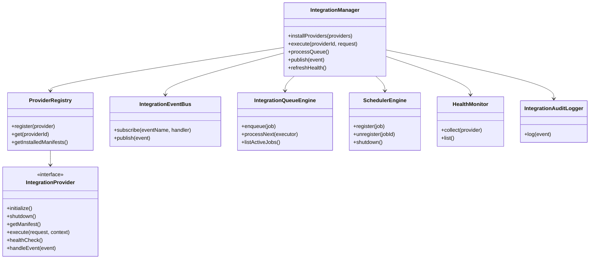
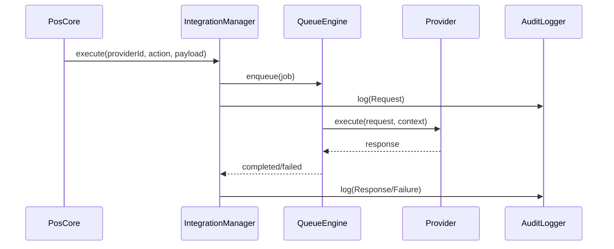

# Generic Integration Framework

## Overview

The Integration Framework is a core subsystem under `src/integrations` that allows external providers to be installed, configured, and executed without coupling provider logic to POS business flows.

Core principles:
- Provider/plugin based
- Event driven
- Offline first with persisted queue
- Capability-based contracts
- Manifest-driven configuration UI
- Health and audit visibility

## Package Structure

```text
src/integrations/
  core/
  events/
  registry/
  queue/
  scheduler/
  configuration/
  security/
  health/
  audit/
  transport/
  storage/
  providers/
    fiscal/
      fbr/
      pra/
```

## Provider Lifecycle

1. Discover bundled providers (`BundledProviderDiscovery`)
2. Register provider in `ProviderRegistry`
3. Validate compatibility and capabilities
4. Initialize provider
5. Execute provider actions through queue jobs
6. Run health checks and publish status
7. Shutdown provider on app teardown

## Contracts

- `IntegrationProvider` defines all lifecycle and capability hooks.
- `ProviderManifest` defines metadata, compatibility, features, and dynamic settings schema.
- `IntegrationExecutionRequest/Response` define execution payloads.
- `IntegrationHealthSnapshot` standardizes monitoring.

## Class Diagram



## Sequence Diagram (Event to Provider Execution)



## Event Model

- Framework supports normalized events (`IntegrationEvent`) and provider subscriptions.
- POS can publish events such as `InvoiceCreated`, `InvoicePaid`, `OrderCreated`, `ShiftClosed`, `InternetDisconnected`.
- Providers handle only events they declare in `manifest.supportedEvents`.

## Queue and Retry

- Queue states: `Pending`, `Running`, `Waiting`, `Completed`, `Failed`, `Cancelled`, `DeadLetter`
- Exponential backoff with optional jitter
- Dedupe support via `dedupeKey`
- IndexedDB persistence via `IndexedDbQueueStore`

## Scheduler

- Providers can register recurring jobs through `SchedulerEngine`
- Use for token refresh, heartbeat, sync, cleanup, and health polling

## Security Layer

- Secret abstraction: `SecretStore`
- Current implementation: `IndexedDbSecretStore`
- Supports auth modes in manifest: API key, OAuth, JWT, certificate, mTLS

## Health Monitoring

`HealthMonitor` collects:
- Connection/auth status
- Average response time
- Pending/failed jobs
- Last sync and cert expiry

## Audit Logging

`IntegrationAuditLogger` writes events to existing tracking pipeline (`postTracking`) for:
- Provider install/remove/update
- Request/response/retry/failure
- Auth and health changes

## Dynamic Settings Renderer

- UI uses `manifest.configurationSchema` to render fields dynamically.
- Supports types:
  - text, number, password
  - checkbox/switch
  - dropdown
  - certificate
  - json
  - dynamic (custom fallback)

## Database Design

Migration file: `migrations/2026_07_08_integrations_framework.surql`

Tables:
- `integration_provider`
- `integration_provider_config`
- `integration_installed_provider`
- `integration_queue`
- `integration_queue_attempt`
- `integration_provider_health`
- `integration_provider_secret`
- `integration_provider_certificate`
- `integration_provider_webhook`
- `integration_schedule`
- `integration_execution_history`

## Example Providers (Phase 1)

- `provider:fbr`
- `provider:pra`

Both are fiscal providers with manifest-driven configuration and shared framework contracts.

## Unit Test Strategy

1. Contract validation for provider manifest/capabilities
2. Queue transitions and retry delay calculations
3. Registry version compatibility checks
4. Manager execution path (enqueue + process)

## Integration Test Strategy

1. Boot manager with multiple providers and process queued jobs
2. Offline simulation with waiting jobs and delayed retries
3. Health collection and audit emission during execution lifecycle

## Provider Catalog vs Runtime State

- `PROVIDER_CATALOG` is the code-level provider registry. Adding a new provider here requires a rebuild.
- `integration_installed_provider` is runtime state. Toggling `enabled` here does not require any rebuild.
- New catalog providers are synced as `enabled: false` by default until an admin enables them.

## Provider Migration Guide (Add New Provider)

1. Create provider class implementing `IntegrationProvider`.
2. Define `ProviderManifest` and `configurationSchema`.
3. Add provider factory to `PROVIDER_CATALOG`.
4. Implement `execute`, `healthCheck`, and event handlers as needed.
5. Add provider compliance tests (manifest + execute + health).
6. Enable the provider from Integrations admin and validate dynamic settings.
7. Run `npm run test` and `npm run lint` before release.
