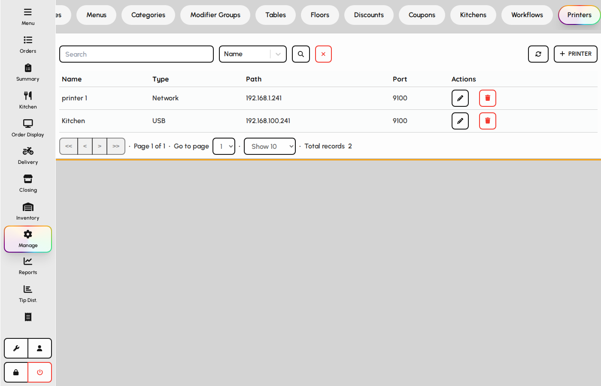
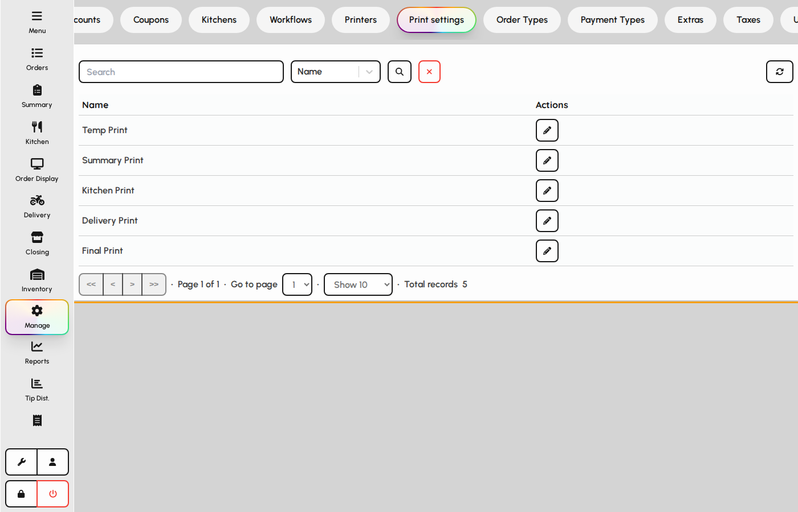
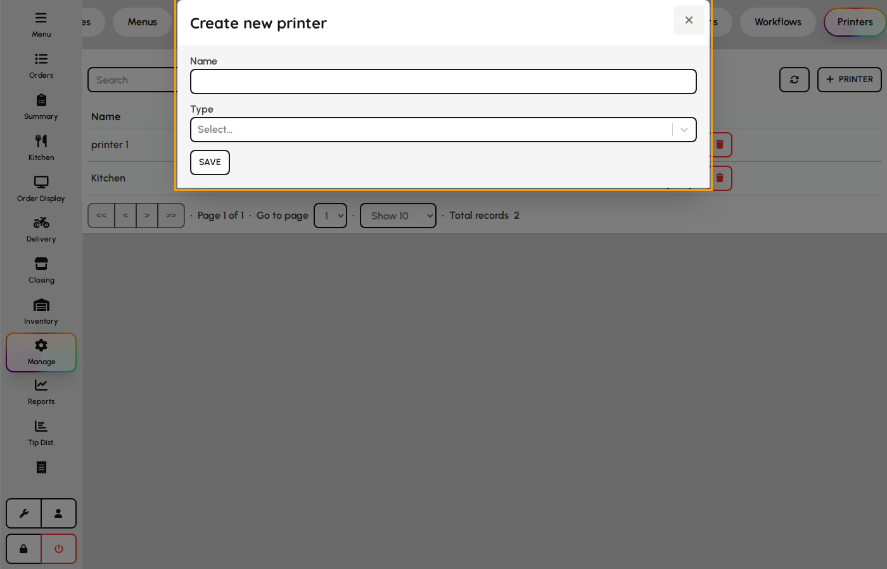
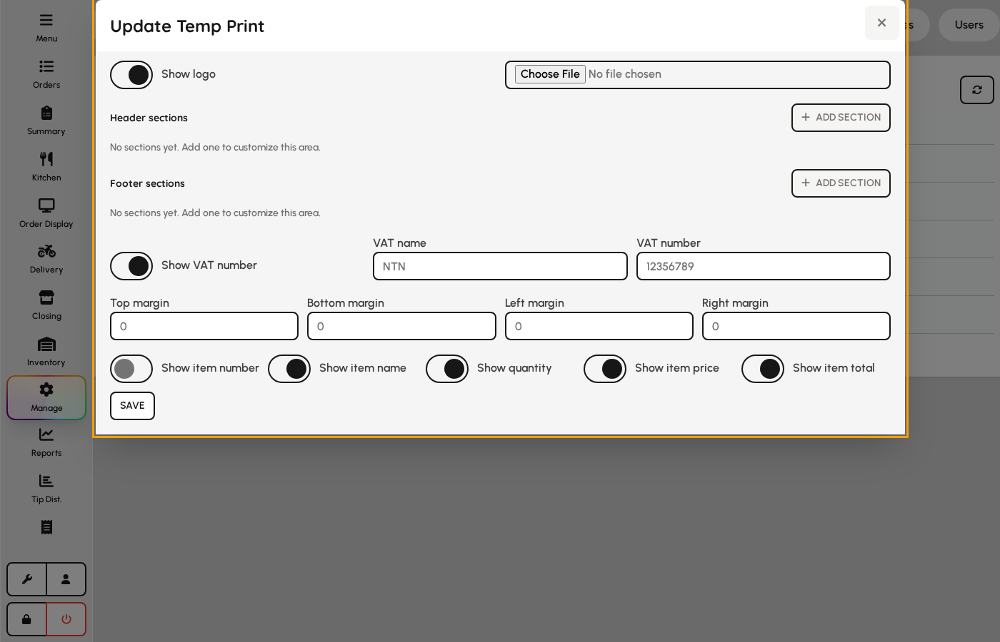

# Printers and print settings

Define printer records in Manage, configure what each print job contains, then assign printers to devices in Settings.

### Printers

Printer records store connection details used across receipt, kitchen, and report printing.

1. Open the Printers tab.
2. Add printers with name, type, and connection settings.
3. Link printers to kitchens and device Settings so tickets reach the right hardware.

*Printers master list in Manage.*

### Print settings

Print settings control templates and options for temp bills, final receipts, kitchen tickets, summaries, delivery slips, and refunds.

1. Open the Print settings tab.
2. Edit each print type (Temp, Final, Kitchen, Summary, Delivery).
3. Save so new orders use the updated layout and fields.

*Print settings tab.*

### Printer form

1. Open Admin → Printing → Printers.
2. Add name and connection: network IP/port or USB identifiers.
3. Choose printer type (receipt, kitchen, label).
4. Save — assign in kitchens and device settings.

**Fields**

- **Name** — Friendly name in admin and device pickers.
- **Type** — Receipt, kitchen, or label driver profile.
- **IP address / port** — Network ESC/POS connection.
- **VID / PID** — USB vendor/product IDs for direct-attached printers.
- **Print mode override** — Optional `text` / `raster` for this device only.
- **Paper width override** — Optional 58 / 80 mm for this device only.

*Printer form.*

### Print setting form

Each print job type (temp bill, final receipt, kitchen, summary, delivery, refund) has its own template.

1. Open Print settings tab and pick a job type.
2. Choose **Print mode** (Text ESC/POS or Raster image) and **Paper width** (58 mm or 80 mm).
3. Configure logo, header/footer sections, VAT block, and margins.
4. Toggle line columns shown on receipts.
5. Save — the next print uses the updated layout and engine.

**Fields**

- **Print mode** — Text (fast ESC/POS commands) or Raster (full ticket as a bit-image for consistent layout across brands).
- **Paper width** — 58 mm (384 dots) or 80 mm (576 dots); used for raster and image centering.
- **Raster threshold / max height** — Optional mono cutoff and chunk height when mode is Raster.
- **Show logo** — Includes uploaded logo on the ticket.
- **Logo width / height / preset** — Print size in dots (default 150×150). Presets fill width and height; images stretch to the box.
- **Header / footer sections** — Text (multi-line, wraps on the printer) or image blocks with optional width/height.
- **VAT name / number** — Tax registration block on guest receipts.
- **Margins** — Top, bottom, left, right spacing in printer dots.
- **Item columns** — Toggle number, name, qty, price, and line total columns.

**Printer overrides**

On Manage → Printers, optional **Print mode override** and **Paper width override** override the print-type settings for that device only. Leave empty to inherit Print settings.

*Print template editor.*
