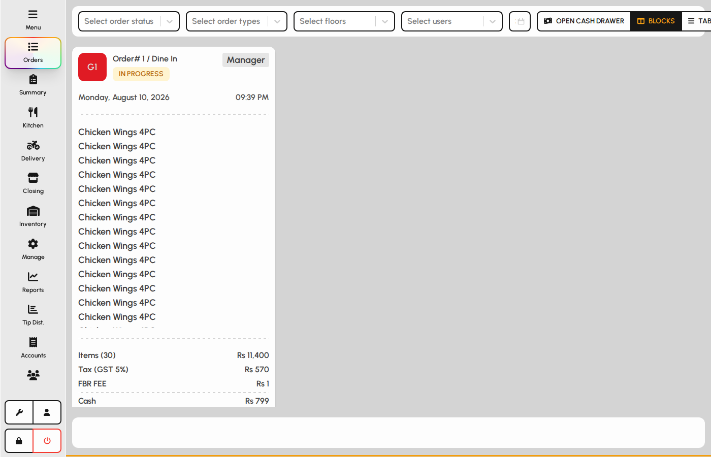
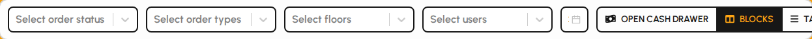
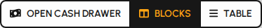
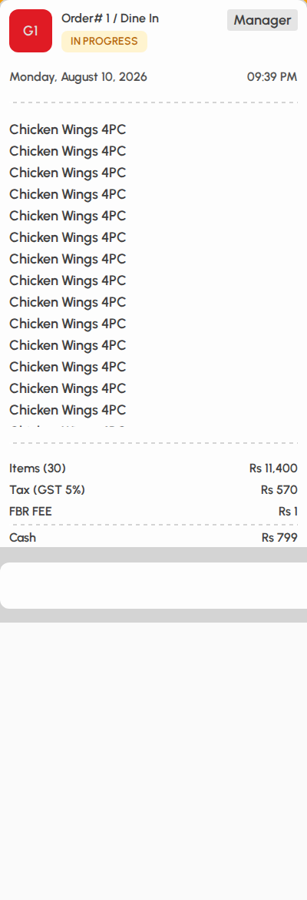
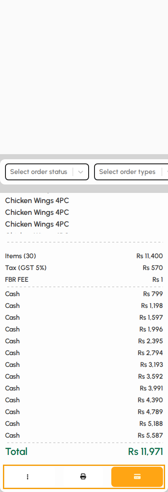
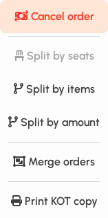
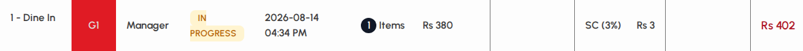

# Orders

The Orders screen lists open and recent checks so you can pay, print, split, merge, cancel, or refund without returning to the floor plan.

### Orders layout

Open Orders from the left sidebar. Filters sit at the top; order cards (or table rows) fill the main area.

1. Tap Orders in the sidebar.
2. Use filters to narrow by status, order type, floor, user, and date.
3. Switch between Blocks and Table views with the toolbar buttons.

*Orders screen with filters and cards.*

### Filters

1. Status: In Progress, Paid, Cancelled, Split, Merged (multi-select).
2. Order type, floor, and user filters limit who and where.
3. The date picker shows paid/historical checks for that day; In Progress still appears when relevant.

*Orders filter bar.*

### Toolbar

1. Open cash drawer pulses the cash drawer when printing and permissions allow it (may require manager PIN).
2. Blocks shows large order cards.
3. Table shows a compact list (tap an In Progress row to pay).

*Cash drawer and view toggles.*

### Order card

Each card shows header, times, line items, totals, and action buttons for In Progress checks.

1. Review invoice number, table, status, server, and items.
2. Temp bill (print) and Pay (card icon) appear for In Progress orders.
3. Use the ⋯ menu for cancel, split, merge, and kitchen print.

*Order card with items and actions.*

### Card actions

1. Temp bill prints a provisional check when allowed.
2. Pay opens the full payment screen for that order.
3. ⋯ opens more actions (see next section).

*Print, Pay, and more on a card.*

### More menu (In Progress)

Protected actions may ask for a manager PIN.

1. Cancel order voids the check through the cancel flow.
2. Split by seats, items, or amount divides one check into multiple.
3. Merge selects this order for multi-table merge (finish with Choose table on the bottom bar).
4. Print KOT copy re-fires kitchen tickets when needed.

*Order more-actions menu.*

### Table view

1. Switch to Table for a dense list of today’s matching orders.
2. Tap an In Progress row to open payment quickly.

*Orders table view.*
